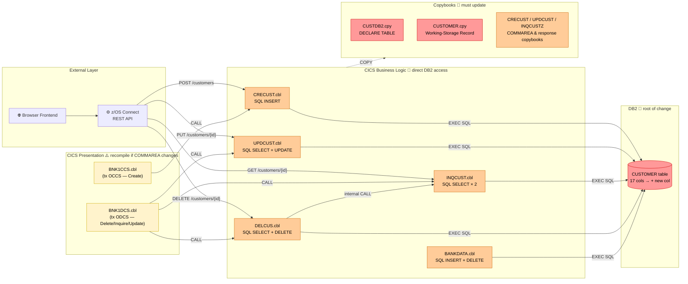
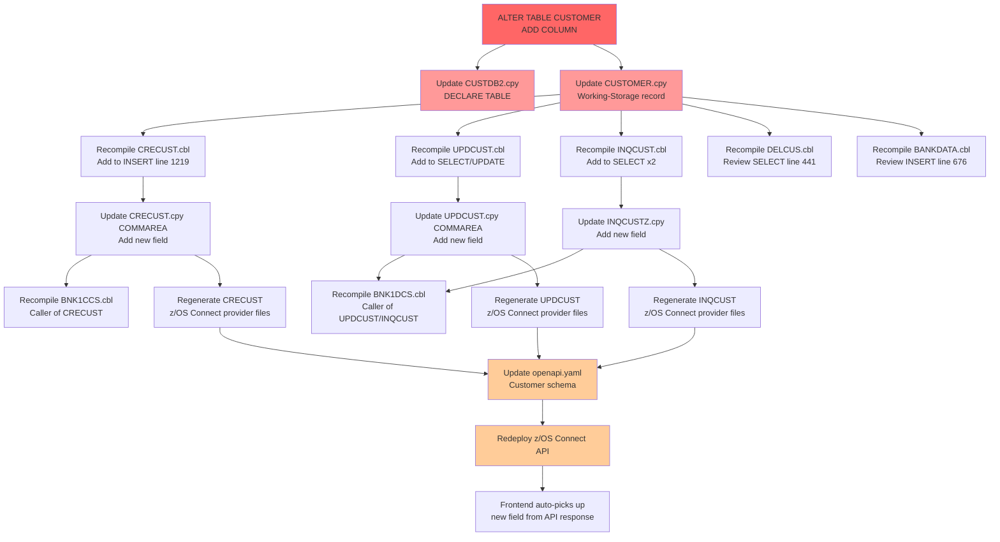

# Impact Analysis Report: Add New Column to DB2 CUSTOMER Table

**Created**: 2025-07-24T00:00:00Z  
**Author**: IBM Bob Z Architect  
**Analysis Method**: Local Workspace (SQL database scan)  
**Workspace Alignment**: Fully Aligned  
**Confidence Level**: High  

---

## 1. Change Summary

### Change Specification

**Title**: Add New Column to DB2 CUSTOMER Table

**Type**: Enhancement

**Description**: Add a new column (e.g., `CUSTOMER_EMAIL CHAR(50)`) to the existing DB2 `CUSTOMER` table. The existing schema has 17 columns covering eyecatcher, sort code, customer number, name, date of birth, phone, address, status, created date, credit score, and credit score review date. This change adds at least one new column to that structure.

**Business Objective**: Extend the customer data model to capture additional customer attributes (e.g., email address or other contact/profile data) for use in customer-facing services and processes.

### System Context

**Architecture Overview**: The Bank of Z application uses a dual-backend architecture. CICS-path customers (`Cnnnn` prefix) are served via DB2. IMS-path customers (`Innn` prefix) are served via a separate IMS HDAM database. Both paths are exposed through a z/OS Connect REST API layer consumed by a browser frontend.

**Key Technologies**: Enterprise COBOL, DB2 (embedded SQL), CICS, z/OS Connect EE, IMS (separate path — not impacted)

**Entry Points**: CICS transactions `OCCS` (create customer) and `ODCS` (delete/inquire/update customer)

**Known Dependencies**: `CUSTDB2.cpy` (DB2 DECLARE TABLE), `CUSTOMER.cpy` (working-storage record), `CRECUST.cpy` (COMMAREA), z/OS Connect provider files for `CRECUST`, `DELCUS`, `INQCUST`, `UPDCUST`

**Workspace Notes**: All CICS COBOL programs and copybooks are present in the local workspace under `src/base/cics/`. IMS programs are NOT impacted (DB2-only change confirmed by user).

---

## 2. Scope Definition

### In Scope

| Component | Role |
|---|---|
| `CUSTDB2.cpy` | DB2 DECLARE TABLE — must be updated to reflect the new column |
| `CUSTOMER.cpy` | Working-storage customer record — must add new field(s) |
| `CRECUST.cpy` | CICS COMMAREA for create-customer — must add field if exposed via API |
| `UPDCUST.cpy` | CICS COMMAREA for update-customer — must add field if exposed via API |
| `INQCUSTZ.cpy` | Inquiry response structure — must add field if exposed via API |
| `CRECUST.cbl` | Inserts new customers — SQL INSERT must include new column |
| `UPDCUST.cbl` | Updates customer data — SQL UPDATE may need to include new column |
| `INQCUST.cbl` | Reads customer data (2 SELECTs) — must add new column to SELECT & host variable |
| `DELCUS.cbl` | Reads then deletes customer — SELECT may need new column for business completeness |
| `BANKDATA.cbl` | Data loader (INSERT + DELETE) — INSERT must be reviewed for new column |
| DB2 `CUSTOMER` table | Schema change — `ALTER TABLE … ADD COLUMN` required |
| z/OS Connect provider files (`CRECUST`, `UPDCUST`, `INQCUST`, `DELCUS`) | API artifacts — regeneration required if COMMAREA is extended |

### Out of Scope

| Component | Reason |
|---|---|
| IMS `CUSTOMER` DBD (`src/base/ims/DBD/CUSTOMER.asm`) | Separate IMS database — user confirmed DB2-only change |
| IMS programs (`IBGCUDAT.cbl`, `IBSCUDAT.cbl`, etc.) | IMS path, not affected |
| `DELCUS.cbl` DELETE statement (line 642) | No column reference — safe; no change needed for the DELETE itself |
| Batch JCL | No batch jobs reference the CUSTOMER table directly |
| Frontend (`src/frontend/`) | API contract is the boundary; frontend reads API responses |

### System Boundaries

- **DB2 table boundary**: The `CUSTOMER` DB2 table is the root of all impact.
- **API boundary**: z/OS Connect is the external boundary. Changes propagate through API provider files to REST response/request schemas, and ultimately the frontend if the field is exposed.
- **IMS boundary**: IMS CUSTOMER database is completely separate and is NOT changed.

### Functional Area

**Primary Functional Area**: Customer Master Data Management  
**Business Function Summary**: Create, inquire, update, and delete customer records for CICS-path customers (prefix `Cnnnn`) via CICS transactions and z/OS Connect REST APIs.

---

## 3. System Overview

### System Context Diagram



**Legend**: 🔴 Red = must change; 🟠 Orange = directly affected (recompile / SQL update); 🟡 Yellow = recompile if COMMAREA changes; ⬜ White = external boundary; `-.->` dashed = COPY dependency

### Programs Directly Accessing CUSTOMER Table

| Program | Statement Types | Cyclomatic Score | Path |
|---|---|---|---|
| `CRECUST.cbl` | INSERT (line 1219) | 61 | `src/base/cics/cobol/` |
| `UPDCUST.cbl` | SELECT (265), UPDATE (363) | 14 | `src/base/cics/cobol/` |
| `INQCUST.cbl` | SELECT (310), SELECT (675) | 25 | `src/base/cics/cobol/` |
| `DELCUS.cbl` | SELECT (441), DELETE (642) | 9 | `src/base/cics/cobol/` |
| `BANKDATA.cbl` | INSERT (676), DELETE (1401) | 43 | `src/base/cics/cobol/` |

### Upstream Callers

| Caller | Called Program | Call Line | CICS Transaction |
|---|---|---|---|
| `BNK1CCS.cbl` | `CRECUST.cbl` | 997 | `OCCS` |
| `BNK1DCS.cbl` | `INQCUST.cbl` | 866 | `ODCS` |
| `BNK1DCS.cbl` | `UPDCUST.cbl` | 1216 | `ODCS` |
| `BNK1DCS.cbl` | `DELCUS.cbl` | 1011 | `ODCS` |
| `DELCUS.cbl` | `INQCUST.cbl` | 303 | (internal call) |
| z/OS Connect API | `CRECUST.cbl` | — | `/customers POST` |
| z/OS Connect API | `UPDCUST.cbl` | — | `/customers/{id} PUT` |
| z/OS Connect API | `INQCUST.cbl` | — | `/customers/{id} GET` |
| z/OS Connect API | `DELCUS.cbl` | — | `/customers/{id} DELETE` |

---

## 4. Dependency Analysis

### Upstream Dependencies

#### Copybook Chain (CUSTOMER.cpy)

`CUSTOMER.cpy` defines the working-storage `CUSTOMER-RECORD` used by all five COBOL programs. Any field added here must also be reflected in:
- `CUSTDB2.cpy` (the `EXEC SQL DECLARE TABLE` declaration)
- `INQCUSTZ.cpy` (the inquiry response layout — also mirrors the record)
- `CRECUST.cpy` (the COMMAREA for the create-customer operation)
- `UPDCUST.cpy` (the COMMAREA for the update-customer operation)

All five copybooks form a **data contract chain** — a field added to the DB2 table must travel through all of these structures if it is to be surfaced to API consumers.

### Downstream Dependencies

#### z/OS Connect API Surface

The z/OS Connect API exposes customer operations as REST endpoints. The API provider files are generated from COMMAREA structures:

| API Endpoint | Method | Backing COBOL | Provider Files Location |
|---|---|---|---|
| `/customers` | POST | `CRECUST.cbl` | `src/api/src/main/zosAssets/CRECUST/providerFiles/` |
| `/customers/{id}` | GET | `INQCUST.cbl` | `src/api/src/main/zosAssets/INQCUST/providerFiles/` (if exists) |
| `/customers/{id}` | PUT | `UPDCUST.cbl` | `src/api/src/main/zosAssets/UPDCUST/providerFiles/` (if exists) |
| `/customers/{id}` | DELETE | `DELCUS.cbl` | `src/api/src/main/zosAssets/DELCUS/providerFiles/` (if exists) |

> **Critical**: z/OS Connect provider copybooks (`*_request_0.cpy`, `*_response_0.cpy`) are generated from the COMMAREA layout. If the COMMAREA is extended to surface the new column, these files **must be regenerated** — the JSON↔COMMAREA transformation is byte-offset based and will produce corrupt data if the COMMAREA grows without regeneration.

---

## 5. Impact Analysis

### Code-Level Impact

#### 1. `CUSTDB2.cpy` — DB2 DECLARE TABLE *(Must Update)*

**Impact Type**: Modify  
**Specific Change**: Add the new column definition to the `EXEC SQL DECLARE TABLE CUSTOMER` block.  
**Example**:
```cobol
EXEC SQL DECLARE CUSTOMER TABLE
   ( ...existing columns...
     CUSTOMER_EMAIL    CHAR(50) )
END-EXEC.
```
**Why**: The precompiler uses this declaration for host variable type checking. Keeping it stale is permitted at runtime for unrelated SQL, but will prevent type-checking for any new SQL that references the new column.  
**Complexity**: Low | **Lines affected**: ~3

---

#### 2. `CUSTOMER.cpy` — Working-Storage Record *(Must Update)*

**Impact Type**: Modify  
**Specific Change**: Add a new `05` field under the appropriate group in `CUSTOMER-RECORD`.  
**Example**:
```cobol
05 CUSTOMER-EMAIL      PIC X(50).
```
**Why**: All 5 COBOL programs use this copybook to map DB2 results into working storage. Without this field, SQL that SELECTs the new column has no host variable to receive the value.  
**Complexity**: Low | **Lines affected**: ~2  
**Ripple Effect**: All programs using this copybook must be recompiled.

---

#### 3. `CRECUST.cbl` — Create Customer *(Must Update)*

**Impact Type**: Modify  
**Specific Change**: 
- Add new host variable in Working-Storage (auto-picked up from `CUSTOMER.cpy` update)
- Modify `EXEC SQL INSERT INTO CUSTOMER` at line 1219 to include the new column and its corresponding host variable
- If nullable: add null indicator variable (`PIC S9(4) COMP`)
- Receive the new field value via COMMAREA  

**Nullability Risk**: If the new column is defined `NOT NULL` without a default, the existing INSERT at line 1219 will fail at runtime with **SQLCODE -407** (NOT NULL violation) or cause implicit rebind failure. The column MUST be defined with `NOT NULL WITH DEFAULT` or as nullable.  
**Complexity**: Medium | **Lines affected**: ~10–15

---

#### 4. `UPDCUST.cbl` — Update Customer *(Must Review)*

**Impact Type**: Modify (if new field should be updateable)  
**Specific Change**:
- SELECT at line 265 should include new column for display/comparison
- UPDATE at line 363 should include new column if it can be updated via this service
- Add host variable and optional null indicator  

**Complexity**: Low–Medium | **Lines affected**: ~8–12

---

#### 5. `INQCUST.cbl` — Inquire Customer *(Must Update)*

**Impact Type**: Modify  
**Specific Change**:
- Both SELECTs (lines 310 and 675) should include the new column
- Add host variable declaration; add null indicator if column is nullable
- Populate `INQCUSTZ` response structure with the new field value  

**DB2 Rule**: If the new column is nullable and no null indicator is used, DB2 will return **SQLCODE -305** at runtime if the column value is NULL for any row.  
**Complexity**: Low | **Lines affected**: ~10

---

#### 6. `DELCUS.cbl` — Delete Customer *(Review Only)*

**Impact Type**: Review  
**Specific Change**: The SELECT at line 441 reads customer data before deletion (likely for validation or audit). Depending on requirements, add the new column to that SELECT and pass it through the response/inquiry structure.  
**Complexity**: Low | **Lines affected**: ~5

---

#### 7. `BANKDATA.cbl` — Data Loader *(Must Update)*

**Impact Type**: Modify  
**Specific Change**: The INSERT at line 676 must be reviewed. If it uses explicit column lists, it is safe to leave as-is only if the new column has `NOT NULL WITH DEFAULT` or is nullable. If it should populate the new column, the INSERT must be extended.  
**Complexity**: Low | **Lines affected**: ~5

---

#### 8. `CRECUST.cpy` / `UPDCUST.cpy` / `INQCUSTZ.cpy` — COMMAREA / Response Structures *(Update if exposing via API)*

**Impact Type**: Modify (conditional on API exposure)  
**Specific Change**: Add new field to the COMMAREA copybook so that the CICS program can receive/return the new value from/to the API caller. These copybooks define the data contract between the API layer and the COBOL program.  
**Complexity**: Low | **Lines affected**: ~2 per copybook

---

### Application-Level Impact

#### Interface Changes

| Interface | Change | Affected Callers |
|---|---|---|
| `CRECUST` COMMAREA | +1 new field (if exposed) | `BNK1CCS.cbl`, z/OS Connect |
| `UPDCUST` COMMAREA | +1 new field (if exposed) | `BNK1DCS.cbl`, z/OS Connect |
| `INQCUSTZ` response structure | +1 new field (if exposed) | `DELCUS.cbl` (calls INQCUST), `BNK1DCS.cbl`, z/OS Connect |

> **COMMAREA extension is a binary-length breaking change**. All callers that pass a fixed-length COMMAREA must be updated simultaneously if the COMMAREA grows. `BNK1CCS.cbl` (cyclomatic 105) and `BNK1DCS.cbl` (cyclomatic 65) are complex programs and deserve careful regression testing.

#### Recompilation Scope

All programs that COPY `CUSTOMER.cpy`, `CUSTDB2.cpy`, `CRECUST.cpy`, `UPDCUST.cpy`, or `INQCUSTZ.cpy` must be recompiled. Based on the dependency scan:

| Copybook Changed | Programs Using It |
|---|---|
| `CUSTOMER.cpy` | `BANKDATA`, `CRECUST`, `DELCUS`, `INQCUST`, `UPDCUST` |
| `CUSTDB2.cpy` | `BANKDATA`, `CRECUST`, `DELCUS`, `INQCUST`, `UPDCUST` |
| `CRECUST.cpy` | `CRECUST` (and `BNK1CCS` indirectly via COMMAREA) |
| `INQCUSTZ.cpy` | `DELCUS`, `INQCUST` |
| `CUSTCTRL.cpy` | `BANKDATA`, `CRECUST` (customer number tracking — no schema change needed) |

**Total programs requiring recompilation**: minimum 5 (`BANKDATA`, `CRECUST`, `DELCUS`, `INQCUST`, `UPDCUST`); plus `BNK1CCS` and `BNK1DCS` if COMMAREAs change.

---

### System-Level Impact

#### DB2 Schema Change

```sql
-- Safe pattern: nullable column (existing rows get NULL)
ALTER TABLE CUSTOMER
  ADD COLUMN CUSTOMER_EMAIL CHAR(50);

-- OR: NOT NULL with default (existing rows get blank string)
ALTER TABLE CUSTOMER
  ADD COLUMN CUSTOMER_EMAIL CHAR(50) NOT NULL WITH DEFAULT;

-- IMPORTANT: NOT NULL without default is NOT permitted if rows already exist
-- DB2 will reject this with SQLCODE -628
```

**Impact on existing rows**: 
- If `NULLABLE`: all existing rows will have `NULL` in the new column → all `SELECT` statements that retrieve this column MUST use a null indicator variable or SQLCODE -305 will occur at runtime.
- If `NOT NULL WITH DEFAULT`: existing rows get the default value → safer for existing programs; null indicator optional unless field value `NULL` is expected later.

#### z/OS Connect API Impact

| Provider Asset | Regeneration Needed? | Condition |
|---|---|---|
| `CRECUST` provider files (`CRECUST_request_0.cpy`, `CRECUST_response_0.cpy`) | **Yes** | If `CRECUST.cpy` COMMAREA is extended |
| `DELCUS` provider files | **Yes** | If `DELCUS.cpy` COMMAREA is extended |
| `UPDCUST` provider files | **Yes** | If `UPDCUST.cpy` COMMAREA is extended |
| `IBGCUDAT` provider files | **No** | IMS path not affected |
| `openapi.yaml` | **Yes** | Customer schema must add new field |

The JSON schema files (`requestSchema.json`, `responseSchema.json`) under each `gen/` folder are auto-generated — do not manually edit them. Regenerate via z/OS Connect EE toolkit after updating the COMMAREA copybook.

---

### Operational Impact

**Deployment Sequence (CRITICAL)**:

1. **DB2 DBA**: `ALTER TABLE CUSTOMER ADD COLUMN …` (with `NOT NULL WITH DEFAULT` recommended)
2. **Compile**: Update and recompile copybooks (`CUSTDB2.cpy`, `CUSTOMER.cpy`, COMMAREA copybooks)
3. **Compile**: Recompile COBOL programs (`CRECUST`, `UPDCUST`, `INQCUST`, `DELCUS`, `BANKDATA`)
4. **Compile**: Recompile caller programs if COMMAREAs changed (`BNK1CCS`, `BNK1DCS`)
5. **API**: Regenerate z/OS Connect provider files; rebuild and redeploy API `.sar`
6. **Test**: Run integration tests (`tests/test_get_customer_cics.sh`, etc.)

> ⚠️ **Do NOT deploy updated COBOL before the DB2 schema change**. Programs with the new INSERT/SELECT column list will fail with SQLCODE -206 (column not found in table) if the column does not yet exist.

**Performance Impact**: Minimal. Adding one `CHAR(50)` column adds 50 bytes per row and a small overhead per I/O operation. No index changes expected unless the new field requires lookups.

---

## 6. Change Propagation Map



---

## 7. Risk Assessment

| # | Risk | Likelihood | Impact | Category | Mitigation |
|---|---|---|---|---|---|
| R1 | New column added as `NOT NULL` without default — existing programs fail with SQLCODE at bind/rebind | High | High | Data Integrity | **Mandate `NOT NULL WITH DEFAULT` or nullable** for the ALTER TABLE |
| R2 | Nullable column without null indicator variable — SQLCODE -305 at runtime when existing rows (with NULL) are read | High | High | Runtime Failure | Add `PIC S9(4) COMP` null indicator to every `SELECT INTO` for the new column |
| R3 | COMMAREA length change deployed without regenerating z/OS Connect provider files — JSON mapping corrupted | High | High | Integration | Regenerate all affected provider files before deploying API |
| R4 | `BNK1CCS.cbl` (complexity 105) or `BNK1DCS.cbl` (complexity 65) introduced regression due to COMMAREA change | Medium | High | Regression | Full regression test of CICS customer transactions after recompile |
| R5 | Deployment order violated — COBOL deployed before DB2 schema change | Medium | High | Runtime Failure | Enforce deployment sequence: DB2 first, then COBOL, then API |
| R6 | `INQCUST.cbl` called internally by `DELCUS.cbl` — indirect data contract breakage if INQCUSTZ layout changes | Medium | Medium | Hidden Dependency | Test `DELCUS` flow end-to-end after `INQCUSTZ.cpy` change |
| R7 | `BANKDATA.cbl` data loader does not set new column — data quality gap for loaded test/seed data | Low | Medium | Data Integrity | Update `BANKDATA.cbl` INSERT or rely on column default |
| R8 | openapi.yaml not updated — API documentation/schema mismatch with actual behavior | Low | Low | Documentation | Update `openapi.yaml` customer schema object as part of the change |

---

## 8. Assumptions and Unknowns

| # | Assumption / Unknown | Type | Impact if Wrong |
|---|---|---|---|
| A1 | The new column will be defined with `NOT NULL WITH DEFAULT` or as nullable (not `NOT NULL` without default) | Assumption | SQLCODE failures at INSERT time for existing programs |
| A2 | Only the DB2 CUSTOMER table is changed; IMS CUSTOMER database is not affected | Confirmed by user | No impact |
| A3 | The new field will be exposed via the z/OS Connect API (COMMAREA must be extended) | Assumption — confirm with business | If not exposed, scope reduces significantly |
| U1 | Whether `DELCUS.cbl` needs to return the new field in its inquiry response | Unknown | May require `INQCUSTZ.cpy` change or not |
| U2 | Exact column name, type, and nullability of the new column | Unknown | Affects copybook field declarations and null indicator requirements |

---

## 9. Confidence Assessment

**Confidence Level**: **High**

**Justification**:
- All 5 COBOL programs directly accessing the `CUSTOMER` table were identified by SQL analysis of the local database.
- All copybook dependencies were traced (CUSTDB2, CUSTOMER, CRECUST, UPDCUST, INQCUSTZ, CUSTCTRL).
- Callers of affected programs were fully enumerated (BNK1CCS, BNK1DCS).
- z/OS Connect API asset structure confirmed via workspace file listing.
- DB2 ADD COLUMN rules confirmed via IBM documentation (nullability, implicit rebind, SQLCODE risks).
- Two unknowns remain (column definition details, API exposure decision) but neither changes the scope map — they affect implementation details, not the set of affected components.

---

## 10. Effort Estimation

| Work Item | Estimated Effort |
|---|---|
| DB2 ALTER TABLE + DBA review | 0.5 days |
| Update copybooks (CUSTDB2, CUSTOMER, COMMAREAs, INQCUSTZ) | 0.5 days |
| Update COBOL programs (CRECUST, UPDCUST, INQCUST, DELCUS, BANKDATA) | 1–2 days |
| Update/recompile BNK1CCS, BNK1DCS (complex callers) | 0.5–1 day |
| z/OS Connect provider file regeneration + API rebuild | 0.5 days |
| Update openapi.yaml | 0.25 days |
| Integration testing | 1 day |
| **Total** | **~4–5.75 days** |

---

## 11. Next Steps

1. **Confirm** the exact column definition (name, type, `NOT NULL WITH DEFAULT` vs nullable) with the DBA team.
2. **Confirm** whether the new field will be exposed through the REST API (drives COMMAREA changes).
3. **Switch to Z Code mode** to implement the changes following the deployment sequence in Section 5.
4. **Run integration tests** after deployment: `bash tests/test_get_customer_cics.sh` and related suites.
5. **Update documentation**: `docs/docs/architecture/application-components.md` should reflect the new field.

> Would you also like me to use Z Understand service for broader cross-application dependency analysis before finalizing?
