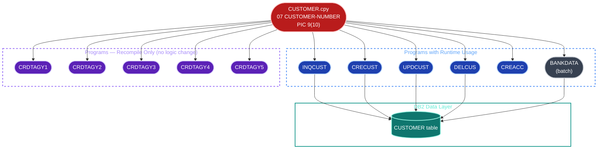
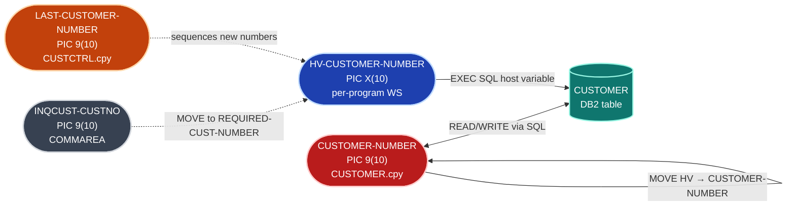
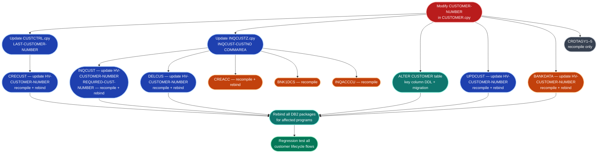

# Impact Analysis Report: CUSTOMER-NUMBER Variable

**Created**: 2025-01-01T00:00:00Z
**Author**: IBM Bob — Z Architect
**Analysis Method**: Local Workspace (SQL database + COBOL Language Server data flow)
**Workspace Alignment**: Not Applicable
**Confidence Level**: High

---

## 1. Change Summary

### Change Specification

**Title**: Impact of changes to `CUSTOMER-NUMBER`

**Type**: Variable Impact Analysis

**Description**: Assess the full blast radius of any modification to the `CUSTOMER-NUMBER` variable — defined in the shared copybook [`CUSTOMER.cpy`](../../src/base/cics/copy/CUSTOMER.cpy) as `07 CUSTOMER-NUMBER PIC 9(10) DISPLAY`. Modifications in scope include field size changes, type changes, or renaming. The analysis covers all CICS COBOL programs, their DB2 host variables, and the DB2 `CUSTOMER` table.

**Business Objective**: Understand all components that must change before modifying this foundational customer identifier, which is the primary key component of the `CUSTOMER` table.

### System Context

**Key Technologies**: Enterprise COBOL, CICS, DB2 (Embedded SQL), Copybooks

**Entry Points**: `CUSTOMER.cpy` — the single shared copybook that propagates the field to all programs

**Known Dependencies**:
- `CUSTOMER.cpy` — defines `CUSTOMER-NUMBER`
- `CUSTCTRL.cpy` — defines `LAST-CUSTOMER-NUMBER` (same 10-digit numeric, used in sequencing)
- `INQCUSTZ.cpy` — defines `INQCUST-CUSTNO PIC 9(10)` (COMMAREA field that feeds `CUSTOMER-NUMBER` in `INQCUST`)
- DB2 `CUSTOMER` table key column

---

## 2. Scope Definition

### In Scope

- **`CUSTOMER.cpy`**: Primary definition of `CUSTOMER-NUMBER PIC 9(10) DISPLAY` — the origin
- **`CUSTCTRL.cpy`**: `LAST-CUSTOMER-NUMBER PIC 9(10)` — parallel sizing dependency
- **`INQCUSTZ.cpy`**: `INQCUST-CUSTNO PIC 9(10)` — COMMAREA field that flows into `CUSTOMER-NUMBER` in `INQCUST`
- **5 CICS COBOL programs** using `CUSTOMER-NUMBER` at runtime: `INQCUST`, `CRECUST`, `UPDCUST`, `DELCUS`, `CREACC`
- **5 CICS COBOL programs** using `HV-CUSTOMER-NUMBER` (DB2 host variable) that must match: `INQCUST`, `CRECUST`, `UPDCUST`, `DELCUS`, `BANKDATA`
- **DB2 `CUSTOMER` table** — key column tied to `CUSTOMER-NUMBER`

### Out of Scope

- **`CRDTAGY1`–`CRDTAGY5`**: Include `CUSTOMER.cpy` but only use `CUSTOMER-CREDIT-SCORE` at runtime — `CUSTOMER-NUMBER` is declared but not accessed in their Procedure Divisions. Recompile required; no logic changes.
- **`BNK1CCA`**: Includes `INQACCCU.cpy` (which contains a `CUSTOMER-NUMBER` declaration) but only uses `CUSTOMER-NUMBER` inside `GET-CUST-DATA_GCD010` via that copybook — no direct access to `CUSTOMER.cpy` field.
- **IMS programs** (`src/base/ims/`): No `CUSTOMER-NUMBER` variable detected in the scanned database.
- **`BANKDATA`**: Batch/test data seeding program — included for completeness (uses `HV-CUSTOMER-NUMBER` and `CUSTOMER-NUMBER` at runtime), but not a CICS transaction.

### System Boundaries

- **External boundary**: DB2 `CUSTOMER` table key column — any column size change requires a DDL `ALTER` and potential data migration
- **CICS boundary**: COMMAREA definitions (`INQCUSTZ.cpy`) that cross transaction boundaries must be updated consistently
- **z/OS Connect API**: The REST API (`src/api/`) surfaces customer data — a key column type/size change affects API response payloads

### Functional Area

**Primary Functional Area**: Customer Master Data Management

**Business Function Summary**: `CUSTOMER-NUMBER` is the 10-digit numeric identifier that uniquely identifies every customer in the bank. It is part of `CUSTOMER-KEY` (combined with `CUSTOMER-SORTCODE`) and maps directly to the primary key of the DB2 `CUSTOMER` table. It flows through every customer lifecycle operation: create, inquire, update, delete, and account inquiry.

---

## 3. System Overview

### System Context Diagram



### Components Analyzed

**Total programs with `CUSTOMER-NUMBER` declared**: 11 CICS COBOL programs

**Programs with runtime usage** (Procedure Division references): 6

**Programs requiring recompile only** (declaration via copybook, no runtime access): 5 (`CRDTAGY1`–`CRDTAGY5`)

**Key Programs**:

| Program | Description | Runtime Usage | Impact Level |
|---|---|---|---|
| `INQCUST` | Customer inquiry | READ + WRITE via `HV-CUSTOMER-NUMBER` + DB2 SQL | **High** |
| `CRECUST` | Create customer | WRITE + READ via `HV-CUSTOMER-NUMBER` + DB2 SQL | **High** |
| `UPDCUST` | Update customer | WRITE + READ via `HV-CUSTOMER-NUMBER` + DB2 SQL | **High** |
| `DELCUS` | Delete customer | READ + WRITE via `HV-CUSTOMER-NUMBER` + DB2 SQL | **High** |
| `CREACC` | Create account | WRITE via `INQACCCU.cpy` path | **Medium** |
| `BANKDATA` | Batch data seeder | WRITE + READ via `HV-CUSTOMER-NUMBER` + DB2 SQL | **Medium** |
| `CRDTAGY1`–`5` | Credit agency agencies | Declaration only, no Procedure Division usage | **Low** |

**Copybooks directly involved**:

| Copybook | Role | Programs Using It |
|---|---|---|
| [`CUSTOMER.cpy`](../../src/base/cics/copy/CUSTOMER.cpy) | Defines `CUSTOMER-NUMBER PIC 9(10) DISPLAY` | INQCUST, CRECUST, UPDCUST, DELCUS, CREACC, BANKDATA, CRDTAGY1–5 |
| [`CUSTCTRL.cpy`](../../src/base/cics/copy/CUSTCTRL.cpy) | Defines `LAST-CUSTOMER-NUMBER PIC 9(10)` — same width | BANKDATA, CRECUST |
| [`INQCUSTZ.cpy`](../../src/base/cics/copy/INQCUSTZ.cpy) | Defines `INQCUST-CUSTNO PIC 9(10)` — COMMAREA input | INQCUST, BNK1DCS, CREACC, DELCUS, INQACCCU |

**DB2 Tables**:

| Table | Access | Affected Programs | Impact |
|---|---|---|---|
| `CUSTOMER` | READ/WRITE | INQCUST, CRECUST, UPDCUST, DELCUS, BANKDATA | **High** — key column |
| `ACCOUNT` | READ/WRITE | CREACC, INQACCCU, BANKDATA | Low — no `CUSTOMER-NUMBER` column access |
| `PROCTRAN` | WRITE | CREACC, CRECUST, DELCUS | Low — no `CUSTOMER-NUMBER` column access |

---

## 4. Dependency Analysis

### Upstream Dependencies

**What feeds `CUSTOMER-NUMBER`**:

| Source | Location | Feeds Into | Notes |
|---|---|---|---|
| `INQCUST-CUSTNO` (COMMAREA) | `INQCUSTZ.cpy:8` — `PIC 9(10)` | `REQUIRED-CUST-NUMBER` → `HV-CUSTOMER-NUMBER` in `INQCUST` | Must resize if `CUSTOMER-NUMBER` resizes |
| `NCS-CUST-NO-VALUE` | `INQCUST.cbl:119` — `PIC 9(16) COMP` | `REQUIRED-CUST-NUMBER` → `HV-CUSTOMER-NUMBER` | Counter; resize safe if destination grows |
| `RANDOM-CUSTOMER` | `INQCUST.cbl:95` — computed via `COMPUTE` | `REQUIRED-CUST-NUMBER` → `HV-CUSTOMER-NUMBER` | Used for random customer retrieval |
| DB2 `SELECT INTO :HV-CUSTOMER-NUMBER` | `INQCUST.cbl:310`, `678` | `HV-CUSTOMER-NUMBER` → `CUSTOMER-NUMBER` | DB2 column governs the actual data size |
| `LAST-CUSTOMER-NUMBER` | `CUSTCTRL.cpy:14` — `PIC 9(10)` | Used in `CRECUST` to sequence new customer numbers | Must change in lock-step |

### Downstream Dependencies

**What `CUSTOMER-NUMBER` feeds into**:

| Destination | Location | Relationship | Impact |
|---|---|---|---|
| `HV-CUSTOMER-NUMBER PIC X(10)` | Per-program Working Storage | Receives `CUSTOMER-NUMBER` via `MOVE` | Must match new size; note: declared as `PIC X`, not `PIC 9` |
| `CUSTOMER-KEY` group item | `CUSTOMER.cpy:10` | Parent structure containing `CUSTOMER-NUMBER` | Record length changes if field size changes |
| `CUSTOMER-RECORD` group item | `CUSTOMER.cpy:7` | Outer structure — total length impacted | All programs holding a `CUSTOMER-RECORD` buffer are affected |
| `REQUIRED-CUST-NUMBER2` | `INQCUST.cbl:93` | Receives `HV-CUSTOMER-NUMBER` via `MOVE` | Must match |
| DB2 `CUSTOMER` table key column | DB2 schema | Ultimate data store | DDL `ALTER TABLE` required |

### Dependency Flow Diagram



### Internal Dependencies (Copybooks)

| Copybook | Programs | Dependency Type | Change Needed? |
|---|---|---|---|
| `CUSTOMER.cpy` | 11 programs | Defines `CUSTOMER-NUMBER` directly | **Yes — root of change** |
| `CUSTCTRL.cpy` | `BANKDATA`, `CRECUST` | `LAST-CUSTOMER-NUMBER` — parallel 10-digit counter | **Yes — must match** |
| `INQCUSTZ.cpy` | 5 programs | `INQCUST-CUSTNO` — COMMAREA input to `INQCUST` | **Yes — COMMAREA crossing** |

---

## 5. Impact Analysis

### Code-Level Impact

#### [`CUSTOMER.cpy`](../../src/base/cics/copy/CUSTOMER.cpy) — **Root Change**

**Impact Type**: Modify  
**Changes Required**: Update `07 CUSTOMER-NUMBER PIC 9(10) DISPLAY` to new size/type  
**Complexity**: Low  
**Ripple Effect**: Forces recompile of all 11 programs that include this copybook

---

#### [`CUSTCTRL.cpy`](../../src/base/cics/copy/CUSTCTRL.cpy) — **Parallel Field**

**Impact Type**: Modify  
**Changes Required**: Update `LAST-CUSTOMER-NUMBER PIC 9(10) DISPLAY` to match  
**Complexity**: Low  
**Note**: This field holds the last-assigned customer number used to generate the next one in `CRECUST`. Mismatched sizes would cause numeric truncation on customer creation.

---

#### [`INQCUSTZ.cpy`](../../src/base/cics/copy/INQCUSTZ.cpy) — **COMMAREA Boundary**

**Impact Type**: Modify  
**Changes Required**: Update `INQCUST-CUSTNO PIC 9(10)` to match  
**Complexity**: Medium  
**Note**: This is a CICS COMMAREA definition shared across transaction boundaries. All programs that include it (`BNK1DCS`, `CREACC`, `DELCUS`, `INQACCCU`, `INQCUST`) must be recompiled together. The COMMAREA length is fixed at runtime — mismatched sizes between caller and callee cause data corruption.

---

#### [`INQCUST.cbl`](../../src/base/cics/cobol/INQCUST.cbl) — **High Impact**

**Impact Type**: Modify  
**Paragraphs Affected**:
- `READ-CUSTOMER-DB2_RCD010` (lines 308, 310, 358, 395, 441) — uses `HV-CUSTOMER-NUMBER` as DB2 host variable and copies result to `CUSTOMER-NUMBER`
- `GET-LAST-CUSTOMER-DB2_GLCD010` (lines 678, 721) — second SQL SELECT populating `HV-CUSTOMER-NUMBER`

**Changes Required**:
- `HV-CUSTOMER-NUMBER PIC X(10)` in `HOST-CUSTOMER-ROW` (line 51) → new size
- `REQUIRED-CUST-NUMBER PIC 9(10)` in `CUSTOMER-KY` (line 89) → new size
- `REQUIRED-CUST-NUMBER2 PIC 9(10)` in `CUSTOMER-KY2` (line 93) → new size

**Complexity**: Medium

---

#### [`CRECUST.cbl`](../../src/base/cics/cobol/CRECUST.cbl) — **High Impact**

**Impact Type**: Modify  
**Paragraphs Affected**:
- `WRITE-CUSTOMER-DB2_WCD010` (lines 1148, 1163, 1201, 1219, 1279, 1302) — writes and reads `CUSTOMER-NUMBER` / `HV-CUSTOMER-NUMBER` around DB2 INSERT
- `GET-LAST-CUSTOMER-DB2_GLCD010` (line 1545) — reads `LAST-CUSTOMER-NUMBER` from control record to generate next customer number

**Changes Required**:
- `HV-CUSTOMER-NUMBER` Working Storage declaration → new size
- All `MOVE` statements between `CUSTOMER-NUMBER` and `HV-CUSTOMER-NUMBER`

**Complexity**: Medium

---

#### [`UPDCUST.cbl`](../../src/base/cics/cobol/UPDCUST.cbl) — **High Impact**

**Impact Type**: Modify  
**Paragraphs Affected**:
- `UPDATE-CUSTOMER-DB2_UCD010` (lines 263, 265, 363, 397) — uses `HV-CUSTOMER-NUMBER` in DB2 UPDATE WHERE clause

**Changes Required**:
- `HV-CUSTOMER-NUMBER` Working Storage declaration → new size

**Complexity**: Low

---

#### [`DELCUS.cbl`](../../src/base/cics/cobol/DELCUS.cbl) — **High Impact**

**Impact Type**: Modify  
**Paragraphs Affected**:
- `DEL-CUST-DB2_DCD010` (lines 435, 439, 441, 559, 640, 642) — uses `HV-CUSTOMER-NUMBER` across DELETE, SELECT, and MOVE statements
- `GET-ACCOUNTS_GAC010` (lines 400, 406) — reads `CUSTOMER-NUMBER` from `INQACCCU.cpy` path

**Changes Required**:
- `HV-CUSTOMER-NUMBER` Working Storage declaration → new size

**Complexity**: Medium

---

#### [`CREACC.cbl`](../../src/base/cics/cobol/CREACC.cbl) — **Medium Impact**

**Impact Type**: Modify  
**Paragraphs Affected**:
- `CUSTOMER-ACCOUNT-COUNT_CAC010` (line 1177) — writes to `CUSTOMER-NUMBER` (from `INQACCCU.cpy`)

**Changes Required**:
- Recompile required (includes `CUSTOMER.cpy` and `INQACCCU.cpy`)
- Verify `CUSTOMER-NUMBER` Working Storage sizing in `INQACCCU.cpy` is consistent

**Complexity**: Low

---

#### [`BANKDATA.cbl`](../../src/base/cics/cobol/BANKDATA.cbl) — **Medium Impact (batch)**

**Impact Type**: Modify  
**Paragraphs Affected**:
- `PREMIERE_A010` (lines 511, 632, 676, 716) — sets and reads `CUSTOMER-NUMBER` and `HV-CUSTOMER-NUMBER` for DB2 INSERT

**Changes Required**:
- `HV-CUSTOMER-NUMBER` Working Storage declaration → new size

**Complexity**: Low

---

#### `CRDTAGY1`–`CRDTAGY5` — **Recompile Only**

**Impact Type**: Recompile  
**Changes Required**: None — include `CUSTOMER.cpy` but only use `CUSTOMER-CREDIT-SCORE` at runtime  
**Complexity**: Low

---

### Application-Level Impact

#### COMMAREA Interface Changes

The COMMAREA crossing is the highest-risk interface boundary:

| COMMAREA Copybook | Current Size | Programs Sharing It | Risk |
|---|---|---|---|
| `INQCUSTZ.cpy` — `INQCUST-CUSTNO` | `PIC 9(10)` = 10 bytes | `INQCUST`, `BNK1DCS`, `CREACC`, `DELCUS`, `INQACCCU` | **High** — must be identical across all |

All 5 programs sharing `INQCUSTZ.cpy` must be recompiled and deployed together. A size mismatch at runtime causes CICS COMMAREA data corruption with no compile-time error.

#### Batch Job Impact

| Program | Job Type | Impact |
|---|---|---|
| `BANKDATA` | Batch data seeder | Must update `HV-CUSTOMER-NUMBER` and recompile |

---

### System-Level Impact

#### DB2 `CUSTOMER` Table

`CUSTOMER-NUMBER` forms part of the composite primary key alongside `CUSTOMER-SORTCODE`. Any size change requires:

```sql
-- Example: expanding from CHAR(10) to CHAR(12)
ALTER TABLE STTESTER.CUSTOMER
  ALTER COLUMN CUSTOMER_NUMBER SET DATA TYPE CHAR(12);

-- Existing data must be padded / migrated
UPDATE STTESTER.CUSTOMER
  SET CUSTOMER_NUMBER = LPAD(CUSTOMER_NUMBER, 12, '0');
```

**Key risks**:
- DB2 does not allow shrinking a column with existing data without data loss
- All precompiled COBOL programs that use `HV-CUSTOMER-NUMBER` as a host variable must be rebound after a column type change — DB2 package invalidation occurs automatically but **every affected package must be rebound**
- Any existing DB2 indexes on `CUSTOMER_NUMBER` must be rebuilt

#### z/OS Connect API (`src/api/`)

The `src/api/` layer exposes customer data over REST. If `CUSTOMER-NUMBER` changes size or type, the JSON response schema changes (the `customerId` field). API consumers must be notified.

---

## 6. Change Propagation Map



### Propagation Paths Summary

**Path 1 — Copybook cascade**
```
CUSTOMER.cpy change
  → All 11 COBOL programs including it must be recompiled
  → 6 programs with runtime usage require code changes (HV-CUSTOMER-NUMBER sizing)
```

**Path 2 — COMMAREA boundary (critical)**
```
INQCUSTZ.cpy change (INQCUST-CUSTNO)
  → INQCUST, BNK1DCS, CREACC, DELCUS, INQACCCU
  → All 5 must be deployed atomically — COMMAREA length mismatch = data corruption
```

**Path 3 — DB2 host variable + package rebind**
```
HV-CUSTOMER-NUMBER size change in INQCUST, CRECUST, UPDCUST, DELCUS, BANKDATA
  → DB2 precompile output changes → packages must be explicitly rebound
  → DB2 CUSTOMER column DDL ALTER required first
```

**Path 4 — Control record sizing**
```
CUSTCTRL.cpy LAST-CUSTOMER-NUMBER change
  → CRECUST customer number sequencing logic
  → Risk of numeric overflow if counter field is smaller than CUSTOMER-NUMBER
```

---

## 7. Risk Assessment

| Risk ID | Description | Category | Likelihood | Impact | Level | Mitigation |
|---|---|---|---|---|---|---|
| R1 | COMMAREA size mismatch between `INQCUSTZ.cpy` callers | Regression | High | High | **CRITICAL** | Deploy all 5 COMMAREA-sharing programs atomically in one step |
| R2 | DB2 package invalidation — programs run against stale plan | Runtime Failure | High | High | **CRITICAL** | Explicitly rebind all packages after column DDL change; do not rely on auto-rebind |
| R3 | `LAST-CUSTOMER-NUMBER` in `CUSTCTRL.cpy` not resized — numeric truncation on new customer creation | Data Integrity | Medium | High | **HIGH** | Change `CUSTCTRL.cpy` in the same release as `CUSTOMER.cpy` |
| R4 | Existing DB2 `CUSTOMER` rows require data migration | Data Integrity | High | High | **HIGH** | Prepare and test a migration script in non-prod before production deployment |
| R5 | `HV-CUSTOMER-NUMBER` declared as `PIC X` (character), not `PIC 9` (numeric) — MOVE from `PIC 9(10)` to `PIC X(10)` works but mismatched sizes cause truncation | Data Integrity | Medium | High | **HIGH** | Ensure `HV-CUSTOMER-NUMBER` size matches new `CUSTOMER-NUMBER` size in all 5 programs |
| R6 | `CRDTAGY1`–`5` recompile missed — stale load modules | Regression | Medium | Medium | **MEDIUM** | Include all copybook dependents in the build job, not just runtime users |
| R7 | z/OS Connect API schema change breaks REST consumers | Integration | Medium | Medium | **MEDIUM** | Version the API or communicate breaking change in advance |
| R8 | `NCS-CUST-NO-VALUE PIC 9(16) COMP` feeds `REQUIRED-CUST-NUMBER` — truncation if new size exceeds 16 digits | Runtime Failure | Low | Medium | **LOW** | Verify `NCS-CUST-NO-VALUE` range accommodates new size |

### Critical Risks

#### R1 — COMMAREA Atomicity
`INQCUST-CUSTNO` in `INQCUSTZ.cpy` crosses a CICS COMMAREA boundary. CICS does not validate COMMAREA length at linkage time — a mismatch between the sender and receiver results in silent data corruption or ASRA abend. All 5 programs sharing this copybook must be deployed in a single step with no intermediate state.

**Action**: Use a coordinated NEWCOPY/PHASEIN for all 5 programs simultaneously.

#### R2 — DB2 Package Rebind
When the DB2 `CUSTOMER` table key column changes type or size, all precompiled packages that reference it are invalidated. While DB2 performs lazy auto-rebind on first execution, this can fail at runtime if the new column definition is incompatible with the old host variable type. Explicit rebind during the maintenance window eliminates this risk.

**Action**: Issue `REBIND PACKAGE(...)` for `INQCUST`, `CRECUST`, `UPDCUST`, `DELCUS`, and `BANKDATA` packages immediately after the DDL `ALTER`.

---

## 8. Confidence Assessment

**Overall Confidence: High**

| Category | Confidence | Reason |
|---|---|---|
| Copybook dependencies | High | Complete — SQL database enumerates all inclusions |
| Runtime variable usage | High | SQL + COBOL Language Server data flow traced all paths |
| DB2 host variable mapping | High | `HV-CUSTOMER-NUMBER` identified in all 5 SQL programs |
| COMMAREA boundaries | High | `INQCUSTZ.cpy` consumers fully identified |
| DB2 table impact | High | `CUSTOMER` table access confirmed via SQL queries |
| IMS programs | High | No `CUSTOMER-NUMBER` found in scanned IMS programs |
| z/OS Connect API | Medium | API project in `src/api/` exists; exact field mapping not analyzed |

---

## 9. Next Steps

### Immediate

1. Confirm the exact nature of the `CUSTOMER-NUMBER` change (size, type, or rename) — the blast radius is known; the implementation plan depends on the specific modification
2. Assess whether the DB2 `CUSTOMER` table column DDL change is backward compatible (expand = safe, shrink = data loss risk)
3. Check `INQACCCU.cpy` — `BNK1CCA`, `CREACC`, `DELCUS`, and `INQACCCU` share it; contains a second `CUSTOMER-NUMBER` declaration that must be consistent

### Before Implementation

1. **Create an implementation plan** using the implementation-planning skill to sequence the changes correctly (DDL first, then copybooks, then programs, then rebind)
2. **Coordinate deployment** — the COMMAREA change requires atomic deployment of 5 programs
3. **Prepare DB2 migration script** — test data migration in a non-production DB2 subsystem first

### Deployment Sequence (Mandatory Order)

1. DB2 DDL `ALTER TABLE CUSTOMER` key column
2. DB2 data migration/padding script
3. Update `CUSTOMER.cpy`, `CUSTCTRL.cpy`, `INQCUSTZ.cpy`
4. Recompile and relink all 11 affected programs
5. DB2 rebind all packages (`INQCUST`, `CRECUST`, `UPDCUST`, `DELCUS`, `BANKDATA`)
6. CICS atomic NEWCOPY: `INQCUST`, `BNK1DCS`, `CREACC`, `DELCUS`, `INQACCCU`
7. Regression test full customer lifecycle (create → inquire → update → delete)

---

*End of Impact Analysis Report*
