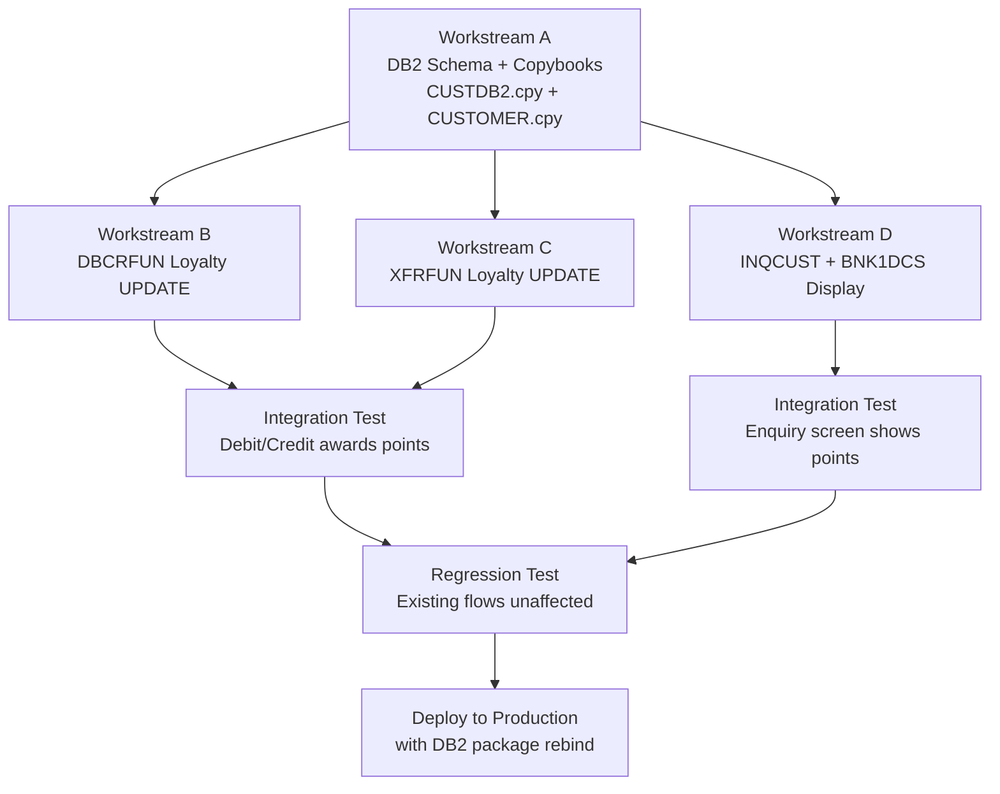

# Implementation Plan: Customer Loyalty Program

**Created**: 2025-07-21T00:00:00Z  
**Author**: IBM Bob Premium Package for Z AI Assistant  
**Analysis Method**: Local Workspace  
**Workspace Alignment**: Fully Aligned  
**Data Dictionary Coverage**: Partial — `DBCRFUN`, `XFRFUN`, `BNK1DCS`, `UPDCUST`, `INQCUST` require data dictionary generation before implementation

---

## 1. Executive Summary

**Change Description**: Add a loyalty points programme to Bank of Z. Every debit, credit, or transfer transaction will award 1 loyalty point per £1 of transaction amount. Points and tier are stored in two new nullable columns on the existing `CUSTOMER` DB2 table. Customers can view their points balance via the existing customer detail screen (BNK1DCS → INQCUST).

**Business Value**: Increases customer retention and engagement by rewarding regular banking activity. Requires minimal new infrastructure — the existing transaction and customer-enquiry flows are reused.

**Key Risks**:
1. DB2 package rebind required after `ALTER TABLE` — must be planned as a deployment step
2. `DBCRFUN` and `XFRFUN` already share the `ACCOUNT` and `PROCTRAN` DB2 tables; a failed loyalty UPDATE must not roll back the primary transaction
3. BNK1DCS/INQCUST display area is fixed-width BMS — loyalty fields must fit within available screen real estate

---

## 2. Prerequisites

### Data Dictionary Generation

**Programs requiring data dictionary entries** before implementation begins:

| Program | Path |
|---------|------|
| `DBCRFUN` | `src/base/cics/cobol/DBCRFUN.cbl` |
| `XFRFUN` | `src/base/cics/cobol/XFRFUN.cbl` |
| `BNK1DCS` | `src/base/cics/cobol/BNK1DCS.cbl` |
| `INQCUST` | `src/base/cics/cobol/INQCUST.cbl` |
| `UPDCUST` | `src/base/cics/cobol/UPDCUST.cbl` |

**Rationale**: Variable descriptions in these programs provide essential context for understanding which Working-Storage areas, COMMAREA fields, and SQLCODE handlers to extend. Generating data dictionary entries first preserves implementation context.

**How to trigger subtask** (run in Z Code mode):

```
Use the data-dictionary-management skill to scan and generate entries for:
- src/base/cics/cobol/DBCRFUN.cbl
- src/base/cics/cobol/XFRFUN.cbl
- src/base/cics/cobol/BNK1DCS.cbl
- src/base/cics/cobol/INQCUST.cbl
- src/base/cics/cobol/UPDCUST.cbl
Save all entries to bobz/DD.json.
```

---

## 3. Requirements

### Functional Requirements

- **FR1**: Award 1 loyalty point per £1 of transaction amount (absolute value) on every debit, credit, and transfer transaction processed by `DBCRFUN` and `XFRFUN`
- **FR2**: Store loyalty points balance and loyalty tier in the `CUSTOMER` DB2 table
- **FR3**: Derive loyalty tier automatically from points balance: Bronze < 500, Silver 500–1999, Gold 2000–4999, Platinum ≥ 5000
- **FR4**: Display loyalty points and tier on the existing BNK1DCS customer enquiry screen
- **FR5**: A loyalty-update failure must not roll back or abort the primary debit/credit/transfer transaction

### Non-Functional Requirements

- **NFR1**: Loyalty UPDATE SQL must not increase transaction response time by more than 50ms — use a simple single-row UPDATE by customer primary key
- **NFR2**: New DB2 columns must be nullable and additive (backward-compatible with all existing programs)
- **NFR3**: All affected DB2 packages/plans must be rebound as part of the deployment

### Business Requirements

- **BR1**: Customers holding active accounts should automatically accumulate points; no opt-in required for v1
- **BR2**: Points are persistent and cumulative — they are never reset by normal banking operations in this phase

---

## 4. Goals and Non-Goals

### Goals

1. Extend the `CUSTOMER` DB2 table with `LOYALTY_POINTS` (INTEGER) and `LOYALTY_TIER` (CHAR(10)) columns
2. Extend `CUSTDB2.cpy` with the two new column declarations
3. Extend `CUSTOMER.cpy` with corresponding COBOL group-level fields
4. Modify `DBCRFUN` to calculate and persist loyalty points after each debit/credit operation
5. Modify `XFRFUN` to calculate and persist loyalty points on transfer transactions
6. Modify `BNK1DCS` BMS map and COBOL screen program to display the loyalty fields
7. Modify `INQCUST` to SELECT and return the new columns

### Non-Goals

1. No loyalty redemption or rewards catalogue in this phase
2. No loyalty points for account creation/deletion events
3. No IMS path changes (IMS customer records are a separate data store — out of scope for v1)
4. No batch recalculation of historical transactions
5. No customer-facing opt-out mechanism in v1

---

## 5. Current State Analysis

### System Context

**Programs Analysed**: 32 programs in local database

**Key Programs for This Change**:

| Program | Role | Change Required |
|---------|------|----------------|
| `DBCRFUN` | Processes over-counter debit and credit transactions; writes to `ACCOUNT` and `PROCTRAN` | **Modify** — add loyalty UPDATE |
| `XFRFUN` | Processes account-to-account transfers; writes to `ACCOUNT` and `PROCTRAN` | **Modify** — add loyalty UPDATE |
| `INQCUST` | Enquires on the `CUSTOMER` DB2 row by customer number | **Modify** — SELECT new columns |
| `BNK1DCS` | CICS pseudo-conversational presentation layer for customer details | **Modify** — display new fields |
| `UPDCUST` | Updates customer record in DB2 | **Modify** — extend host variable structure |
| `CRECUST` | Creates new customer records | **No change** — INSERT enumerates columns; NULL inserted automatically |

**DB2 Tables**:

| Table | Affected | Reason |
|-------|----------|--------|
| `CUSTOMER` | Yes — schema change | Two new nullable columns: `LOYALTY_POINTS`, `LOYALTY_TIER` |
| `ACCOUNT` | No | Read/written by DBCRFUN/XFRFUN; no loyalty data |
| `PROCTRAN` | No | Processed transaction log; no loyalty data |

**Copybooks**:

| Copybook | Role | Change Required |
|----------|------|----------------|
| `CUSTDB2.cpy` | EXEC SQL DECLARE CUSTOMER TABLE | **Modify** — add two column declarations |
| `CUSTOMER.cpy` | COBOL group-level customer record | **Modify** — add two new 05-level fields |
| `ACCDB2.cpy` | ACCOUNT table declaration | No change |
| `PROCTRAN.cpy` | Transaction structure | No change |

### Key Findings

1. `DBCRFUN` already retrieves `HV-ACCOUNT-CUST-NO` from the ACCOUNT row — this customer number can be used directly as the WHERE key for the loyalty UPDATE without an additional SELECT
2. `XFRFUN` similarly holds the account's customer number after reading the ACCOUNT row
3. The existing `CUSTDB2.cpy` uses `EXEC SQL DECLARE TABLE` syntax — the two new columns can be appended to this declaration cleanly
4. `CUSTOMER.cpy` currently has 14 fields — two new 05-level fields can be appended without disturbing the existing REDEFINES/group structure
5. `BNK1DCS` calls `INQCUST` to retrieve customer data — extending `INQCUST` to return loyalty fields is the correct integration point rather than a direct DB2 call from `BNK1DCS`
6. `CRECUST` uses an enumerated INSERT (not `INSERT ... VALUES(*)`), so it will automatically insert NULL into the new columns with no code change

### Assumptions

- Transaction amounts processed by `DBCRFUN` and `XFRFUN` are always non-negative after absolute-value conversion; points = TRUNC(ABS(amount))
- The `CUSTOMER` row for a given account always exists when `DBCRFUN`/`XFRFUN` executes — the account-to-customer relationship is enforced at account creation
- Loyalty tier thresholds (Bronze/Silver/Gold/Platinum) are fixed for v1; no external configuration table is needed
- BMS map `BNK1DCM` has sufficient unprotected display space to add two fields; actual available columns must be verified against the physical BMS definition

### Constraints

- The loyalty UPDATE in `DBCRFUN`/`XFRFUN` must use `SQLCODE = 0` success-only commit logic — if the loyalty UPDATE fails it must be logged but must NOT roll back the debit/credit/transfer
- DB2 column names must follow the existing underscore naming convention: `LOYALTY_POINTS`, `LOYALTY_TIER`
- COBOL host variable names must follow the existing `HV-` prefix convention: `HV-LOYALTY-POINTS`, `HV-LOYALTY-TIER`

---

## 6. Implementation Design

### Workstreams

#### Workstream A: DB2 Schema & Copybook Changes

**Purpose**: Extend the data model to carry loyalty state, without breaking any existing program.

**Tasks**:
1. Prepare and test DDL script to `ALTER TABLE CUSTOMER ADD COLUMN LOYALTY_POINTS INTEGER`
2. Prepare and test DDL script to `ALTER TABLE CUSTOMER ADD COLUMN LOYALTY_TIER CHAR(10)`
3. Update `src/base/cics/copy/CUSTDB2.cpy` — append two column declarations to the DECLARE TABLE
4. Update `src/base/cics/copy/CUSTOMER.cpy` — append two 05-level fields after `CUSTOMER-CS-REVIEW-DATE`
5. Execute DDL in test environment and verify existing programs still compile and run correctly
6. Rebind all DB2 packages/plans that include `CUSTOMER` table access after DDL execution

**Dependencies**: None — this workstream must complete before Workstreams B, C, and D can begin

---

#### Workstream B: DBCRFUN — Loyalty Points Accumulation

**Purpose**: Award loyalty points after each successful debit/credit transaction.

**Tasks**:
1. Add host variables to `DBCRFUN` Working-Storage:
   - `WS-LOYALTY-POINTS-EARNED  PIC S9(9) COMP` — points to add this transaction
   - `HV-LOYALTY-POINTS         PIC S9(9) COMP` — current points from DB2
   - `HV-LOYALTY-TIER           PIC X(10)` — current tier from DB2
   - Indicator variables: `HV-LP-IND  PIC S9(4) COMP`, `HV-LT-IND  PIC S9(4) COMP`
2. After the existing ACCOUNT UPDATE and PROCTRAN INSERT succeed, add loyalty calculation:
   - `COMPUTE WS-LOYALTY-POINTS-EARNED = FUNCTION INTEGER(FUNCTION ABS(transaction-amount))`
3. Add SQL: `UPDATE CUSTOMER SET LOYALTY_POINTS = LOYALTY_POINTS + :WS-LOYALTY-POINTS-EARNED WHERE CUSTOMER_SORTCODE = :HV-ACCOUNT-SORTCODE AND CUSTOMER_NUMBER = :HV-ACCOUNT-CUST-NO`
4. Recalculate tier based on new total and issue a second UPDATE for `LOYALTY_TIER`
5. Add SQLCODE handler: if SQLCODE ≠ 0, write a CICS WRITE to CSSL/SYSOUT with a warning message — do NOT roll back

**Dependencies**: Workstream A must complete first (copybook changes must be in place)

---

#### Workstream C: XFRFUN — Loyalty Points Accumulation

**Purpose**: Award loyalty points on the source-account side of a transfer transaction.

**Tasks**:
1. Mirror the host variable additions from Workstream B into `XFRFUN` Working-Storage
2. After the existing ACCOUNT UPDATE (debit side) and PROCTRAN INSERT succeed, add the same loyalty calculation and UPDATE SQL as in Workstream B
3. Loyalty points are awarded on the debit (source) account holder only — the receiving account holder does not earn points for an incoming transfer in v1
4. Add the same non-fatal SQLCODE handler as Workstream B

**Dependencies**: Workstream A; can run in parallel with Workstream B

---

#### Workstream D: Customer Enquiry Display (INQCUST + BNK1DCS)

**Purpose**: Surface loyalty balance and tier on the existing customer detail screen.

**Tasks**:
1. Extend `INQCUST.cbl` SELECT statement to include `LOYALTY_POINTS` and `LOYALTY_TIER`; add host variables and indicator variables for both new columns
2. Extend `INQCUST.cpy` (the COMMAREA copybook used to pass results back to `BNK1DCS`) with two new fields
3. Update `BNK1DCS.cbl` to receive and display the new `INQCUST` fields
4. Update BMS map `BNK1DCM.bms` to add two new display fields (unprotected, intensity=BRT for visibility)
5. Format loyalty display as: `POINTS: 00001250   TIER: GOLD`

**Dependencies**: Workstream A; can run in parallel with Workstreams B and C

---

### Execution Sequence



**Critical Path**:
1. Workstream A (DB2 DDL + copybook updates) — blocks everything else
2. Workstreams B, C, D in parallel
3. Integration testing across all three streams
4. Regression testing of existing customer and account flows
5. Production deployment with package rebind

**Parallel Work Opportunities**:
- Workstreams B, C, and D can all begin immediately once Workstream A is complete

---

## 7. Affected Components

### Programs

| Program | Change Type | Reason | Workspace Status |
|---------|-------------|--------|-----------------|
| `DBCRFUN` | Modify | Add loyalty points accumulation after debit/credit | Available |
| `XFRFUN` | Modify | Add loyalty points accumulation on source account transfer | Available |
| `INQCUST` | Modify | SELECT new loyalty columns; extend return COMMAREA | Available |
| `BNK1DCS` | Modify | Display loyalty points and tier on customer screen | Available |
| `UPDCUST` | Modify | Extend host variable structure for new columns | Available |

### Database Tables

| Table | Change Type | Reason |
|-------|-------------|--------|
| `CUSTOMER` | Modify — ADD COLUMN | New `LOYALTY_POINTS INTEGER` and `LOYALTY_TIER CHAR(10)` columns |

### Copybooks

| Copybook | Change Type | Reason | Workspace Status |
|----------|-------------|--------|-----------------|
| `CUSTDB2.cpy` | Modify | Add two column declarations to EXEC SQL DECLARE TABLE | Available |
| `CUSTOMER.cpy` | Modify | Add two 05-level COBOL fields to customer record | Available |
| `INQCUST.cpy` | Modify | Extend COMMAREA definition with loyalty return fields | Available |

### BMS Maps

| Map | Change Type | Reason |
|-----|-------------|--------|
| BNK1DCM (in `src/base/cics/bms/`) | Modify | Add two display fields for loyalty points and tier |

---

## 8. Data Model Changes

### DB2 Schema Changes

#### CUSTOMER Table

**Changes**:
```sql
ALTER TABLE CUSTOMER
  ADD COLUMN LOYALTY_POINTS INTEGER,
  ADD COLUMN LOYALTY_TIER   CHAR(10);
```

**Migration Requirements**: No data migration. Existing rows will return NULL until updated by a transaction; NULL loyalty points are treated as 0 in all display and calculation logic.

**Backward Compatibility**: Safe — both columns are nullable. No existing COBOL program uses `SELECT *` against CUSTOMER; all use enumerated column selects and enumerated INSERTs.

**Deployment Note**: All DB2 packages and plans that contain static SQL referencing the CUSTOMER table must be rebound after the DDL executes. Programs to rebind: `CRECUST`, `INQCUST`, `UPDCUST`, `DELCUS`, `BANKDATA`.

### COBOL Data Structure Changes

#### `CUSTOMER.cpy`

**Append after `CUSTOMER-CS-REVIEW-DATE` group (line 41)**:
```cobol
          05 CUSTOMER-LOYALTY-POINTS       PIC S9(9) COMP.
          05 CUSTOMER-LOYALTY-TIER         PIC X(10).
```

#### `CUSTDB2.cpy`

**Append before the closing `END-EXEC` (after `CUSTOMER_CS_REVIEW_DATE`)**:
```cobol
              LOYALTY_POINTS               INTEGER,
              LOYALTY_TIER                 CHAR(10)
```

#### `INQCUST.cpy` (COMMAREA return structure)

**Add loyalty return fields** to the communication area used between `INQCUST` and `BNK1DCS`.

---

## 9. Risks and Mitigations

| Risk | Likelihood | Impact | Mitigation |
|------|-----------|--------|-----------|
| Loyalty UPDATE in DBCRFUN/XFRFUN fails (e.g., SQLCODE -904 resource unavailable) | Low | Low | Loyalty UPDATE uses non-fatal error handling — logs a CICS warning, does not roll back the primary transaction |
| DB2 package rebind missed during deployment | Medium | High | Add rebind step as mandatory deploy gate; document in deployment runbook |
| BMS map has insufficient columns for new loyalty fields | Medium | Medium | Validate BNK1DCM screen dimensions before coding — if insufficient, use a second display line |
| `SELECT *` usage against CUSTOMER table | Low | High | Grep codebase for `SELECT *` against CUSTOMER before DDL is applied; confirm none exist |
| NULL loyalty points on first transaction causes arithmetic error | Medium | Medium | Add NULL check: if `LOYALTY_POINTS` IS NULL then treat as 0 before adding points earned; use indicator variable |
| IMS customer records out of sync with CICS loyalty data | Low | Low | Documented as out of scope — IMS path does not earn or display points in v1 |

### Critical Risk

**Risk**: DB2 package rebind missed in production deployment  
**Impact**: Existing programs referencing CUSTOMER may receive SQL error -805 (package not found) after DDL  
**Mitigation**: Automate rebind via deployment JCL step immediately following DDL execution; validate with smoke test before opening traffic  
**Contingency**: Roll back DDL using `ALTER TABLE CUSTOMER DROP COLUMN` (DB2 12+) if rebind fails and cannot be corrected within the maintenance window

---

## 10. Testing Strategy

### Unit Tests

**Key Test Cases**:

1. **Debit transaction awards correct points**
   - Requirement: FR1
   - Input: Account transaction of £75.50 (debit)
   - Expected: `LOYALTY_POINTS` incremented by 75 (TRUNC)

2. **Credit transaction awards correct points**
   - Requirement: FR1
   - Input: Credit of £200.00
   - Expected: `LOYALTY_POINTS` incremented by 200

3. **Transfer awards points on source account only**
   - Requirement: FR1
   - Input: Transfer of £300 from Account A to Account B
   - Expected: Account A's customer earns 300 points; Account B's customer earns 0

4. **Tier promotion — Bronze to Silver**
   - Requirement: FR3
   - Input: Customer at 490 points earns 15 points
   - Expected: `LOYALTY_TIER` updated to SILVER

5. **Loyalty UPDATE failure does not abort transaction**
   - Requirement: FR5
   - Simulate: Force DB2 SQLCODE -904 on loyalty UPDATE
   - Expected: Primary debit/credit commits successfully; CICS warning message written; no rollback

6. **NULL points baseline — first transaction**
   - Input: New customer, no prior loyalty row value
   - Expected: NULL treated as 0; `LOYALTY_POINTS` set to points earned on first transaction

### Integration Tests

**Scope**: CICS DBCRFUN → CUSTOMER table → BNK1DCS display

**Key Test Cases**:

1. Full end-to-end: make a debit via BNK1CRA → DBCRFUN, then enquire on customer via BNK1DCS — verify points displayed match transaction amount
2. Multiple transactions accumulate points correctly across sessions
3. Transfer via BNK1TFN → XFRFUN — verify only source customer earns points

### Regression Tests

**Existing Functionality to Validate**:

- `BNK1CCS` → `CRECUST`: Create customer still works; new columns receive NULL — no program changes needed but must verify
- `BNK1DCS` → `INQCUST`: Existing customer fields (name, address, DOB, credit score) still display correctly after BMS map change
- `BNK1UAC` → `UPDACC`: Account update unaffected
- `DELCUS`: Customer delete still executes without referencing loyalty columns
- `BNK1CCA` → `INQACCCU`: Account-by-customer enquiry unaffected

---

## 11. Rollout and Operational Plan

### Deployment Sequence

1. **Pre-deployment**: Run `grep -i "SELECT \*" src/base/cics/cobol/` to confirm no programs use SELECT * against CUSTOMER
2. **Step 1**: Execute DDL (`ALTER TABLE CUSTOMER ADD COLUMN ...`) during low-traffic window
3. **Step 2**: Immediately rebind all affected DB2 packages/plans (CRECUST, INQCUST, UPDCUST, DELCUS, BANKDATA, DBCRFUN, XFRFUN)
4. **Step 3**: Deploy compiled load modules for DBCRFUN, XFRFUN, INQCUST, BNK1DCS, UPDCUST to CICS load library
5. **Step 4**: Deploy updated BMS map (BNK1DCM)
6. **Step 5**: Run smoke tests — perform one debit and verify BNK1DCS shows non-zero points

### Rollback Plan

**Trigger Conditions**:
- SQL -805 errors in CICS logs after deployment
- Loyalty UPDATE causing primary transaction failures
- BNK1DCS screen rendering incorrectly

**Rollback Steps**:
1. Restore previous load module versions for DBCRFUN, XFRFUN, INQCUST, BNK1DCS, UPDCUST
2. Restore previous BMS map BNK1DCM
3. Rebind packages using previous DBRM members
4. If DDL must also be rolled back: `ALTER TABLE CUSTOMER DROP COLUMN LOYALTY_POINTS` and `DROP COLUMN LOYALTY_TIER` (DB2 12+ only)

### Monitoring

- Monitor CICS logs for any new loyalty-UPDATE warning messages after deployment
- Verify `LOYALTY_POINTS` accumulates on the `CUSTOMER` table via DB2 SELECT spot check after first production transactions

---

## Appendix A: Program Inventory

| Program | Statements | Type | Call Depth |
|---------|-----------|------|-----------|
| `DBCRFUN` | 162 | Debit/Credit back-end | Called by BNK1CRA |
| `XFRFUN` | 476 | Transfer back-end | Called by BNK1TFN |
| `BNK1DCS` | 727 | CICS presentation — Delete/Enquire Customer | Calls INQCUST, UPDCUST, DELCUS |
| `INQCUST` | 186 | Customer enquiry back-end | Called by BNK1DCS, CREACC, DELCUS |
| `UPDCUST` | 94 | Customer update back-end | Called by BNK1DCS |
| `CRECUST` | 377 | Customer creation back-end | Called by BNK1CCS — no code change needed |

## Appendix B: Traceability Matrix

| Requirement | Description | Workstream | Test Case |
|-------------|-------------|-----------|----------|
| FR1 | 1 point per £1 debit/credit | B, C | Unit Test 1, 2, 3 |
| FR2 | Store in CUSTOMER table | A | Integration Test 1, 2 |
| FR3 | Auto-derive tier | B, C | Unit Test 4 |
| FR4 | Display on BNK1DCS | D | Integration Test 1 |
| FR5 | Loyalty failure non-fatal | B, C | Unit Test 5 |
| NFR2 | Nullable columns — backward compat | A | Regression — CRECUST |
| NFR3 | Package rebind on deploy | A | Deployment Step 2 |

---

**Last Updated**: 2025-07-21T00:00:00Z  
**Next Review Date**: Before implementation begins
