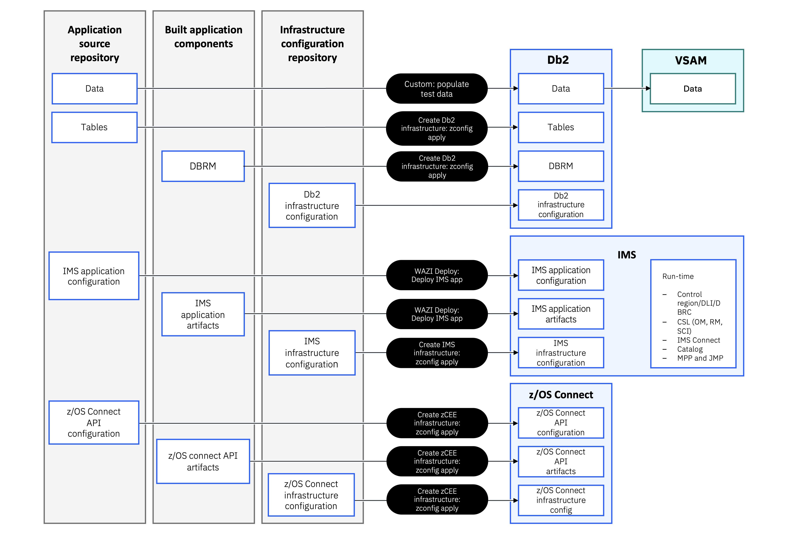

# Build and Deployment Architecture

This page describes how Bank of Z source code is transformed into deployable artifacts and how those artifacts are provisioned across the CICS and IMS runtime environments. The automated delivery pipeline orchestrates build, provisioning, and deployment activities, providing a foundation for future implementation of continuous feedback and progressive quality gates across the software delivery lifecycle.

## Build pipeline

The build process is responsible for automating the compilation of application source changes and dependencies to create deployable artifacts. These artifacts are subsequently packaged, versioned, and managed through the delivery pipeline.

*Figure 1. Relationship between source assets and generated application components.*

Source assets in the repository include:

- COBOL, PL/I, and Assembler application programs
- BMS map definitions
- Db2 source definitions
- Java application source
- z/OS Connect API definitions

The build produces:

- Load modules (COBOL, PL/I, Assembler, and BMS)
- Db2 tables and plans
- Java archive (JAR) files
- z/OS Connect API artifacts
- A Wazi Deploy deployment archive that packages all generated artifacts

## Full and incremental builds

Bank of Z supports both full and incremental build workflows to support different stages of development.

A full build compiles all application components, packages the complete application, and prepares it for deployment. This workflow is typically used during the initial installation or when changes to the runtime infrastructure or environment configuration require a complete redeployment.

An incremental build rebuilds and deploys only the application components affected by source code changes. This workflow is intended for day-to-day development activities, such as implementing enhancements or fixing defects, and avoids rebuilding the entire application or reprovisioning the existing runtime environment.

After the initial deployment, the pipeline automatically detects modified source files, rebuilds only the impacted components, packages the updated artifacts, and deploys them to the existing runtime environment.

**Note**: An incremental build requires an existing Bank of Z environment that has already been deployed successfully. Use a full build and deployment when setting up a new environment or when infrastructure changes require a complete redeployment.

## CICS deployment

After the build completes, Wazi Deploy installs the generated artifacts into the CICS runtime provisioned by zconfig. The z/OS Connect APIs are configured to route requests to the CICS transaction-processing environment.

*Figure 2. CICS, Db2, and z/OS Connect deployment workflow.*

## IMS deployment

After the build completes, Wazi Deploy installs the generated artifacts into the IMS runtime provisioned by zconfig. The z/OS Connect APIs are configured to route requests to the IMS Transaction Manager (TM) environment.

*Figure 3. IMS TM/DB, Db2, and z/OS Connect deployment workflow.*

