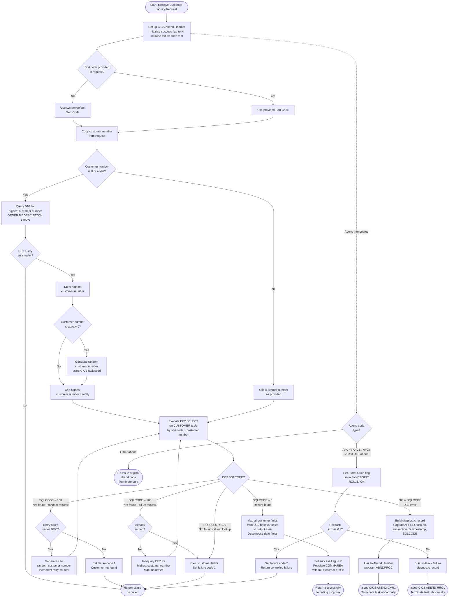

# INQCUST — Customer Inquiry Service

## Business Purpose Summary

**INQCUST** is a **mission-critical CICS service program** in the banking domain that acts as the authoritative customer record retrieval component. Its sole responsibility is to look up a bank customer's complete profile — including personal details, contact information, address, credit score, and account status — and return that information to any calling program via a communication area (COMMAREA).

The program serves as the **single point of truth for customer data access** within the Bank-of-Z core banking system. It is invoked by other programs (such as `INQACCCU`) rather than directly by end users, making it a **back-end service component** in the customer inquiry transaction chain.

### Key Business Capabilities

| Capability | Description |
|---|---|
| **Direct Customer Lookup** | Retrieves a specific customer by customer number and bank sort code |
| **Random Customer Selection** | When called with customer number `0000000000`, randomly selects any valid customer on file — useful for demos, testing, and data browsing |
| **Latest Customer Retrieval** | When called with customer number `9999999999`, returns the most recently registered customer in the bank's database |
| **Not-Found Handling** | Gracefully signals when a requested customer does not exist, returning a blank record with a failure indicator (`INQCUST-INQ-FAIL-CD = '1'`) instead of crashing |
| **Infrastructure Resilience** | Handles VSAM RLS database abends (`AFCR`, `AFCS`, `AFCT`) through a CPSM WLM "Storm Drain" pattern — rolling back changes and returning a controlled failure (`INQCUST-INQ-FAIL-CD = '2'`) rather than allowing a hard crash |
| **DB2 Error Escalation** | On unexpected database errors, assembles a full diagnostic record (abend code `CVR1`, task number, transaction ID, timestamp, SQLCODE) and links to a central abend handler program (`ABNDPROC`) before terminating |

### Business Domain

This program operates in the **retail banking** domain — specifically within the **customer master data** subdomain. It underpins any business process that needs to verify a customer's identity, creditworthiness (`CUSTOMER-CREDIT-SCORE`), or contact details before proceeding (e.g. account inquiry, loan processing, customer service lookups).

### Criticality

**Mission-critical.** Without a functioning customer inquiry service, downstream banking transactions — account inquiries, fund transfers, customer service operations — cannot verify the identity or status of the customer they are acting on behalf of. The program's robust error handling (retry logic, storm drain support, structured abend reporting) reflects this high-availability requirement.

---

## Program Flow

---

Generated by IBM Bob Premium Package for Z
